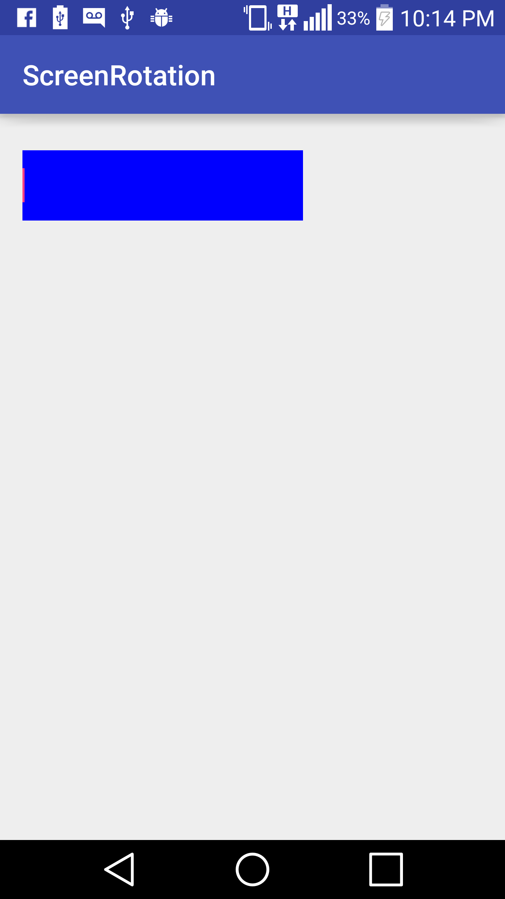
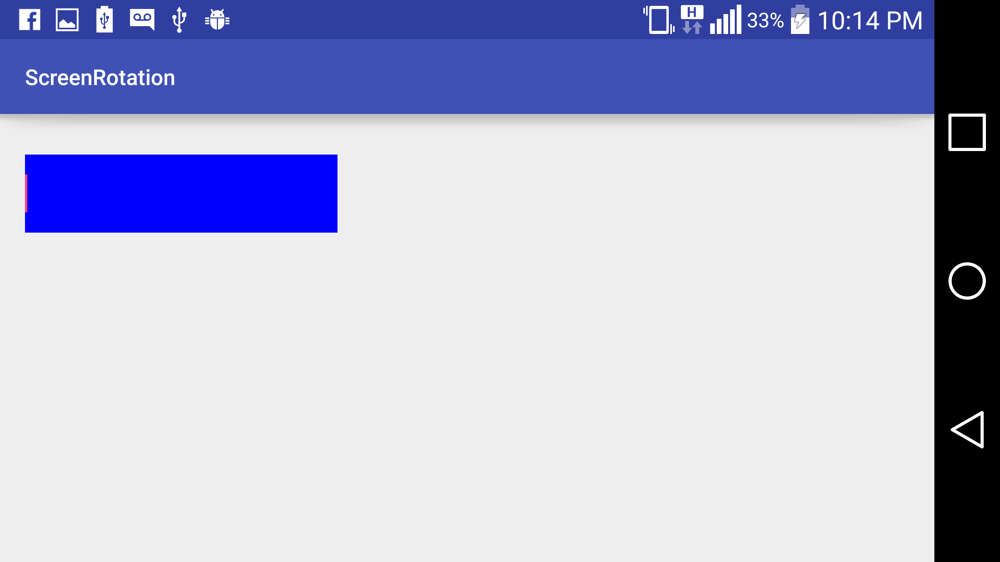

# ScreenOrientation

- See [activity_main.xml](/app/src/main/res/layout/activity_main.xml) portrait layout.
- See [activity_main.xml](/app/src/main/res/layout-land/activity_main.xml) landscape layout.
- See [MainActivity](app/src/main/java/com/bentals/screenrotation/MainActivity.java) for orientation state handling.

